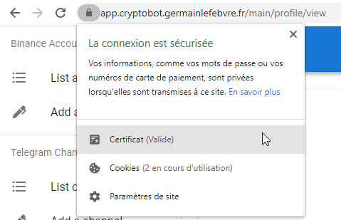
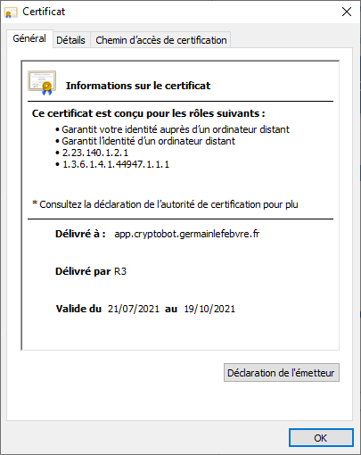

# Cert Manager

## What is Cert Manager
Cert Manager is a component that auto-generte SSL certificates for ingresses in the kubernetes cluster. It's based on Lets' Encrypt (Certbot) component extended to Kubernetes paradigm with CRDs.

Find more information about Cert Manager at [https://cert-manager.io/](https://cert-manager.io/).
https://kubernetes.github.io/ingress-nginx/


## Deployment
Deploy the cert-manager with the following parameters:

* Release name: `cert-manager`
* Chart: [`jetstack/cert-manager`](https://artifacthub.io/packages/helm/cert-manager/cert-manager)
* Namespace: `cert-manager`
* Chart Version: `v1.4.0`
* Config file: `values.yaml`

```bash
helm repo add jetstack https://charts.jetstack.io
helm repo update
helm upgrade -i cert-manager jetstack/cert-manager -n cert-manager --create-namespace --version v1.4.0 -f values.yaml
```

## Configuration
### Staging
```bash
kubectl apply -f cluster-issuer-staging.yaml
```
### Production
```bash
kubectl apply -f cluster-issuer-production.yaml
```

## Check
Check wth your browser the certification validation:




## Uninstall
Remove all the objects generated in the following CRDs: `Issuers`,``ClusterIssuers`, `Certificates`, `CertificateRequests`, `Orders`, `Challenges`.

```bash
kubectl get Issuers,ClusterIssuers,Certificates,CertificateRequests,Orders,Challenges --all-namespaces
```

Remove the Helm chart:
```bash
helm delete cert-manager -n cert-manager
```

Remove the CRDs:
```bash
kubectl delete -f https://github.com/jetstack/cert-manager/releases/download/v1.4.0/cert-manager.crds.yaml
```

Remove the namespace:
```bash
kubectl delete ns/cert-manager
```
